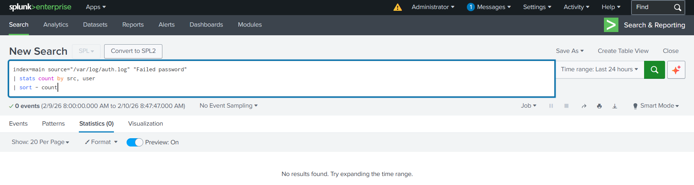
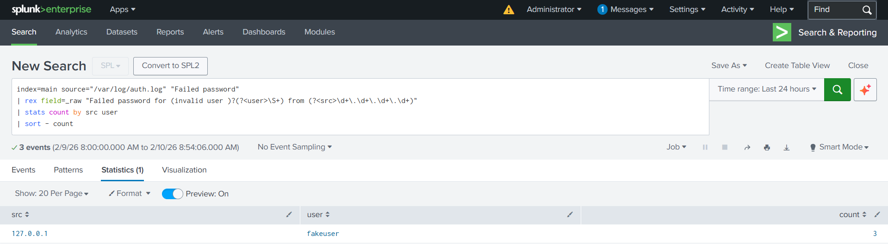
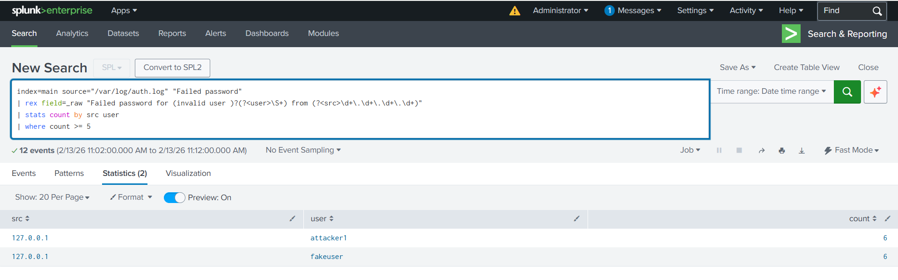
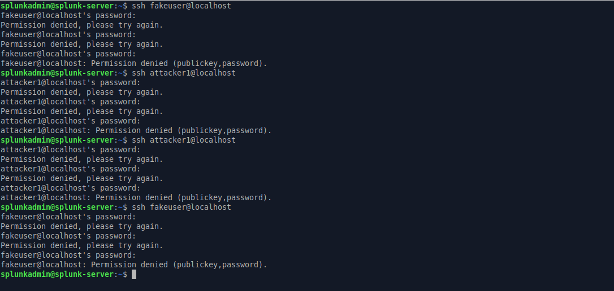
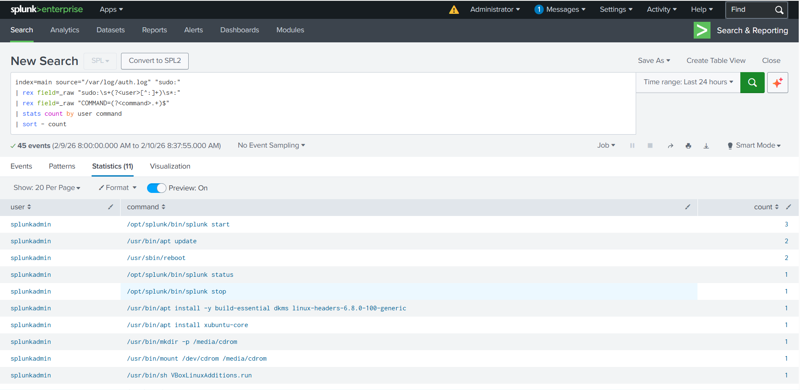
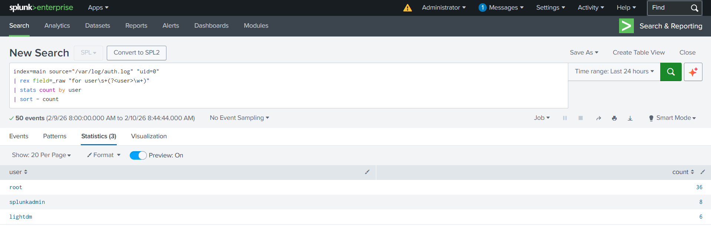
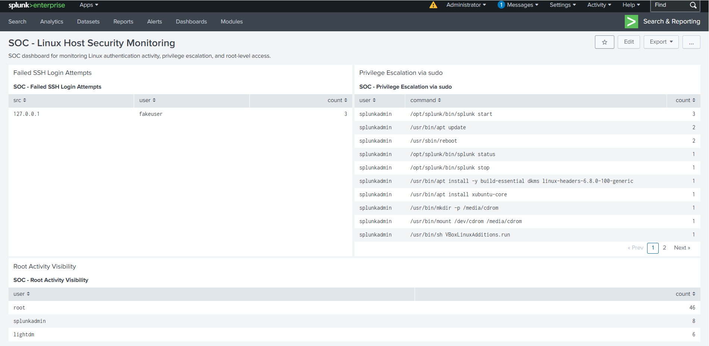
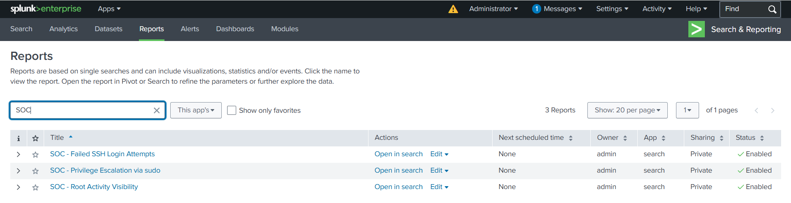
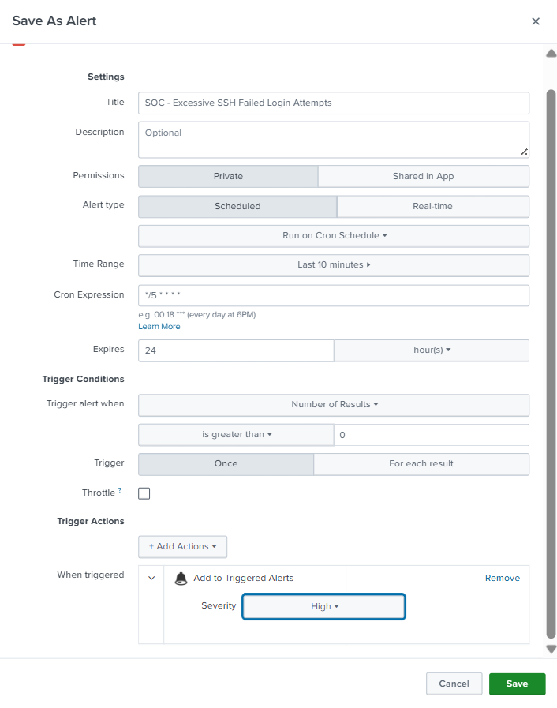
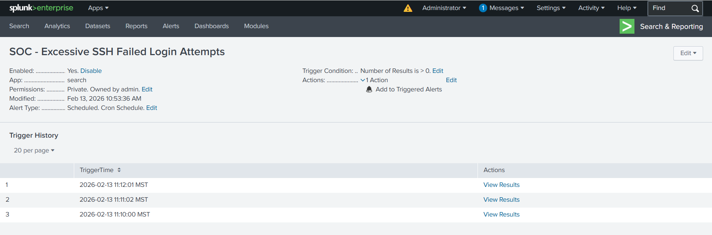

# Project 1 — Linux Host Security Monitoring Using Splunk

## Overview

This project demonstrates the design and implementation of a lightweight **Security Operations Center (SOC)** monitoring solution for a Linux host using **Splunk Enterprise.**

The objective was to simulate real-world attack scenarios, build custom SPL detections, create a monitoring dashboard, and configure scheduled alerts while minimizing alert fatigue.

### Core Focus Areas:
This project focuses on:
* **SSH Brute-force Detection**
* **Privilege Escalation Monitoring**
* **Root Activity Visibility**
* **Alert Threshold Tuning**
* **SOC-style Dashboard Design**

---

## Lab Environment & Prerequisites
To replicate this environment, the following components were utilized:

* **SIEM Platform:** Splunk Enterprise (Trial License)
* **Virtualization:** Oracle VirtualBox
* **Operating System:** Ubuntu Linux (Splunk-SIEM-Server)
* **Log Source:** `/var/log/auth.log`
* **Log Type:** Authentication, `sudo` activity, and SSH logs

> **Note:** Ensure the Splunk user has read permissions for `/var/log/auth.log` on the Ubuntu VM to enable data ingestion.

---

## Detection 1 — Failed SSH Login Attempts

### SPL Query

```spl
index=main source="/var/log/auth.log" "Failed password"
| rex field=_raw "Failed password for (invalid user )?(?<user>\S+) from (?<src>\d+\.\d+\.\d+\.\d+)"
| stats count by src user
| where count >= 5

```
### Purpose
Detect excessive SSH login failures from the same source IP and username combination, indicating possible brute-force activity.

### Failed SSH login attempts before simulation (no result)


### Failed SSH login attempts after simulation


### Failed SSH login attempts detection query


---
## Attack Simulation (Manual SSH Failures)
To validate the detection, multiple failed SSH login attempts were generated from:

- fakeuser@localhost

- attacker1@localhost

**Ubuntu terminal image.**


---
## Detection 2 — Privilege Escalation via sudo

### SPL Query

``` Splunk spl
index=main source="/var/log/auth.log" "sudo:"
| rex field=_raw "sudo:\s+(?<user>[^:]+)\s*:"
| rex field=_raw "COMMAND=(?<command>.+)$"
| stats count by user command
| sort - count

```
### Purpose
Monitor execution of privileged commands via sudo to detect suspicious privilege escalation attempts.

### Result


---
## Detection 3 — Root Activity Visibility

### SPL Query

``` Splunk spl
index=main source="/var/log/auth.log" "uid=0"
| rex field=_raw "for user\s+(?<user>\w+)"
| stats count by user
| sort - count

```

### Purpose
Identify root-level activity across the system to improve visibility into administrative actions.

### Result


---
## SOC Monitoring Dashboard
A centralized dashboard was created to provide SOC-style monitoring of:

- Failed SSH attempts

- Sudo command usage

- Root activity metrics

### Dashboard


---
## Saved Detection Reports
Each detection query was saved as a reusable Splunk report:

- SOC - Failed SSH Login Attempts

- SOC - Privilege Escalation via sudo

- SOC - Root Activity Visibility

### Reports


---
## Alert Configuration — Excessive SSH Failures
A scheduled alert was configured to trigger when:

- More than 5 failed login attempts

- Occur within a 10-minute window

- Evaluated every 5 minutes (Cron: */5 * * * *)

## Alert Settings
- **Alert Type:** Scheduled

- **Time Range:** Last 10 minutes

- **Trigger Condition:** Number of results > 0

- **Action:** Add to Triggered Alerts

- **Severity:** High

- **Throttle:** Disabled (Lab environment)

### Scheduled Alert Configuration


---
## Trigger Validation
To validate alert functionality:

- The alert was temporarily set to run every minute (* * * * *)

- Multiple SSH failures were generated

- Trigger history confirmed successful alert execution

### Trigger History


---
## Alert Fatigue Considerations
To avoid excessive false positives:

- Threshold set to ≥5 failures

- Short time window (10 minutes)

- Scheduled execution (not real-time)

- Action limited to internal alert logging

In production, additional controls would include:

- IP reputation correlation

- User behavior baselining

- Alert throttling

- Email/SOAR integration

---
## Key Skills Demonstrated
- Splunk SPL query development

- Regex field extraction (rex)

- Log parsing and normalization

- Scheduled alert configuration

- SOC dashboard design

- Threshold tuning and alert fatigue mitigation

- Attack simulation and validation

- Incident detection lifecycle workflow

---
## Future Enhancements
- Brute-force detection with time-based charts

- Geo-IP enrichment

- Alert throttling configuration

- Correlation across multiple log sources

- Integration with SOAR workflows

---
## Author
Gelin Mawa
Cybersecurity Portfolio
GitHub: https://github.com/Grammaton26
