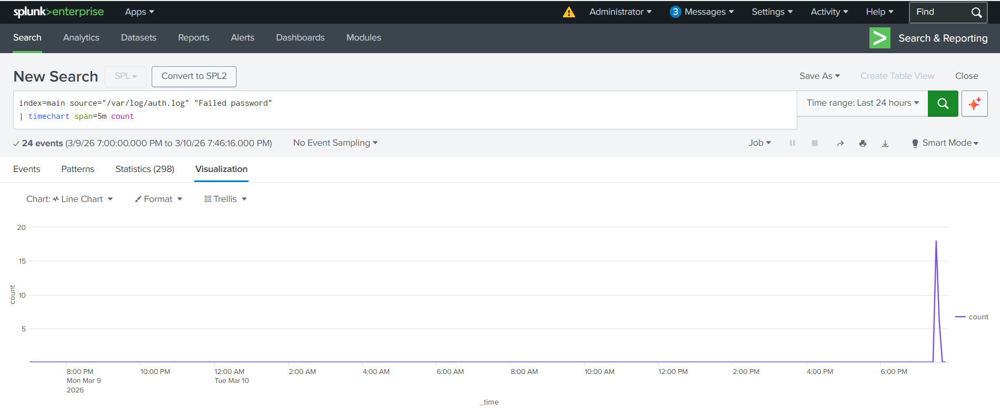
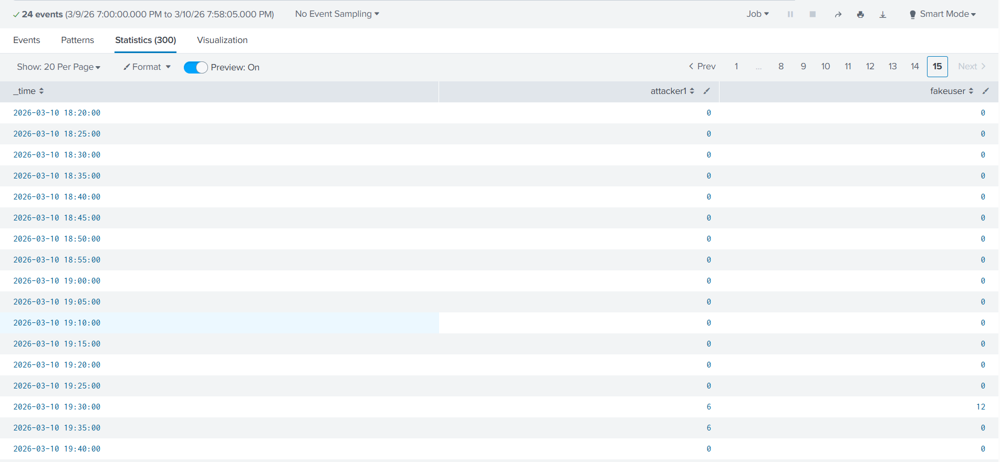
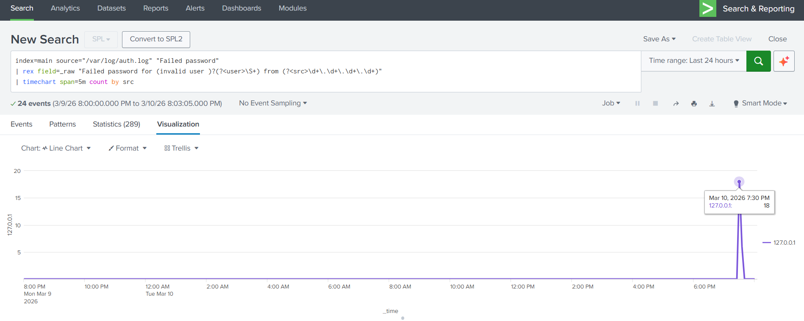
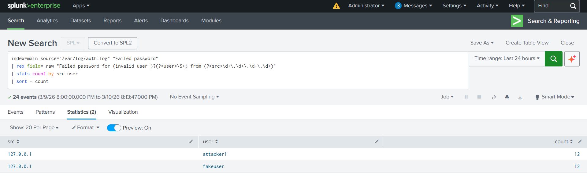
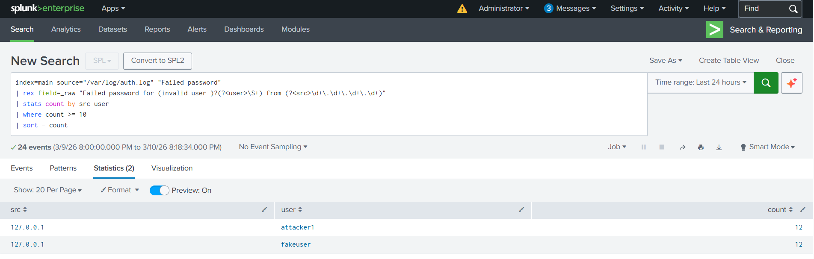
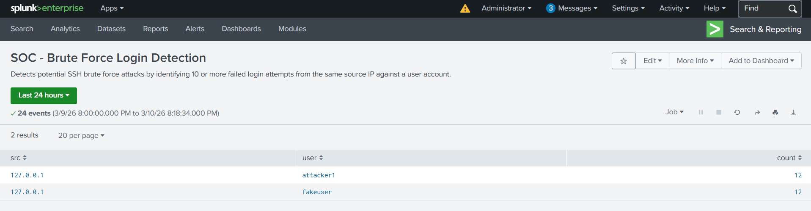
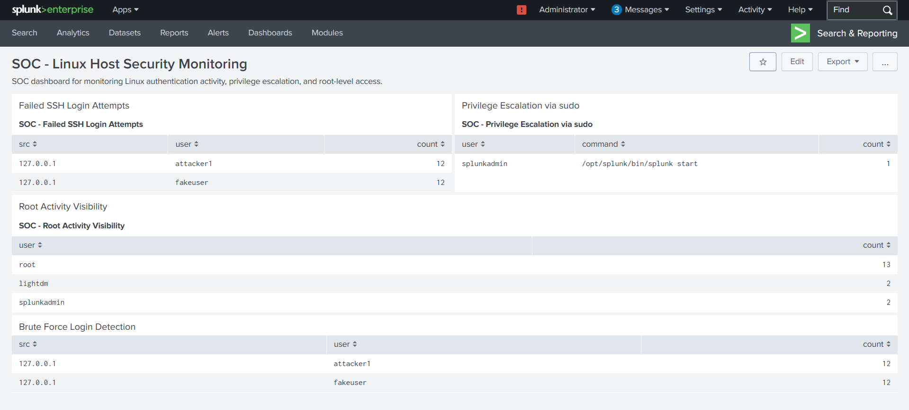
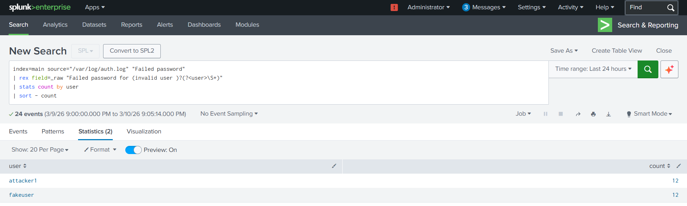

# Project 2 — Brute Force Detection & Threat Hunting Using Splunk

## Overview

This project demonstrates how a Security Operations Center (SOC) analyst can detect and investigate SSH brute-force attacks using Splunk Enterprise.

The objective was to simulate authentication attacks against a Linux host, analyze login failures over time, identify targeted accounts and attacker sources, and build a detection rule capable of identifying brute-force behavior.

The investigation process includes time-based analysis, attacker attribution, user targeting analysis, and the creation of a detection threshold to reduce false positives.

This project focuses on:

* Time-based attack pattern detection
* SSH brute-force investigation
* Source IP attribution
* Account targeting analysis
* SIEM detection rule development
* SOC dashboard monitoring
* Threat hunting queries

---

## Lab Environment

* **SIEM Platform:** Splunk Enterprise (Trial License)
* **Operating System:** Ubuntu Linux (VirtualBox VM)
* **Log Source:** `/var/log/auth.log`
* **Index:** `main`
* **Log Type Monitored:** SSH authentication failures

Attack simulation was performed by generating repeated failed SSH login attempts against test accounts.

## Phase 1 — Time-Based Brute Force Detection

The first step was identifying abnormal spikes in authentication failures.

Using Splunk's `timechart` command, login failures were grouped into five-minute intervals to detect bursts of activity that may indicate automated brute-force attacks.

### SPL Query
```spl
index=main source="/var/log/auth.log" "Failed password"
| timechart span=5m count

```
### Purpose

Detect abnormal spikes in failed login attempts within short time intervals.

### Screenshot — Time-Based Brute Force Spike


---

## Phase 2 — Targeted Account Analysis

Next, usernames were extracted from authentication logs to determine which accounts were targeted by the attack.

### SPL Query
```spl
index=main source="/var/log/auth.log" "Failed password"
| rex field=_raw "Failed password for (invalid user )?(?<user>\S+)"
| timechart span=5m count by user

```
### Purpose

Identify which accounts attackers attempted to access during the brute-force event.

### Screenshot — Targeted User Accounts


---

## Phase 3 — Attacker Source Identification

To determine the origin of the attack, source IP addresses were extracted from authentication logs.

### SPL Query
```spl
index=main source="/var/log/auth.log" "Failed password"
| rex field=_raw "Failed password for (invalid user )?(?<user>\S+) from (?<src>\d+\.\d+\.\d+\.\d+)"
| timechart span=5m count by src

```
### Purpose

Identify which IP addresses are responsible for authentication attack attempts.

### Screenshot — Attacker Source Identification


---

## Phase 4 — Attacker and Target Correlation

To understand which attacker targeted which account, the source IP and username were correlated.

### SPL Query
```spl
index=main source="/var/log/auth.log" "Failed password"
| rex field=_raw "Failed password for (invalid user )?(?<user>\S+) from (?<src>\d+\.\d+\.\d+\.\d+)"
| stats count by src user
| sort - count

```
### Purpose

Identify attacker-to-account relationships during authentication attacks.

### Screenshot — Attacker vs Target Analysis


---

## Phase 5 — Brute Force Detection Rule

A detection threshold was implemented to identify accounts receiving excessive authentication failures.

### SPL Query
```spl
index=main source="/var/log/auth.log" "Failed password"
| rex field=_raw "Failed password for (invalid user )?(?<user>\S+) from (?<src>\d+\.\d+\.\d+\.\d+)"
| stats count by src user
| where count >= 10
| sort - count

```
### Purpose

Detect potential SSH brute-force attacks by identifying accounts receiving ten or more failed login attempts from the same source IP.

### Screenshot — Brute Force Detection Rule


---

## Phase 6 — Detection Report Creation

The detection query was saved as a Splunk report to simulate SOC detection engineering workflows.

Report Name:

`SOC - Brute Force Login Detection`

### Screenshot — Detection Report


---

## Phase 7 — SOC Monitoring Dashboard Integration

The detection report was integrated into the SOC monitoring dashboard alongside other Linux security monitoring panels.

Dashboard panels include:

* Failed SSH Login Attempts
* Privilege Escalation via sudo
* Root Activity Visibility
* Brute Force Login Detection

### Screenshot — SOC Monitoring Dashboard


---

## Phase 8 — Threat Hunting Analysis

Threat hunting queries were used to identify which accounts were targeted most frequently.

### SPL Query
```spl
index=main source="/var/log/auth.log" "Failed password"
| rex field=_raw "Failed password for (invalid user )?(?<user>\S+)"
| stats count by user
| sort - count

```
### Purpose

Identify high-value accounts receiving repeated authentication attack attempts.

### Screenshot — Targeted Accounts Threat Hunting


---

## Alert Fatigue Considerations

To reduce unnecessary alerts, detection thresholds were implemented.

Controls include:

* Minimum threshold of 10 failed attempts
* Aggregation by source IP and username
* Detection rules saved as reports before alerting

In production environments, further improvements would include:

* IP reputation enrichment
* Geo-IP analysis
* behavioral baselining
* alert throttling
* automated response playbooks

---

## Key Skills Demonstrated

* Splunk SPL query development
* regex field extraction (`rex`)
* time-series analysis
* brute-force attack detection
* attacker attribution
* detection threshold tuning
* threat hunting queries
* SOC monitoring dashboard development
* SIEM detection engineering

---

## Future Enhancements

* Geo-IP enrichment for attacker attribution
* brute-force anomaly detection
* correlation with successful login events
* integration with additional Linux log sources
* automated alert response workflows

---

## Author
### Gelin Mawa
Cybersecurity & Data Analytics Portfolio

GitHub Portfolio
https://github.com/Grammaton26/cybersecurity-analysis-portfolio
