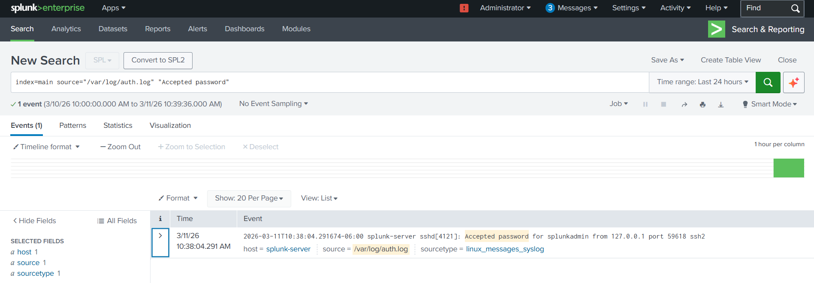
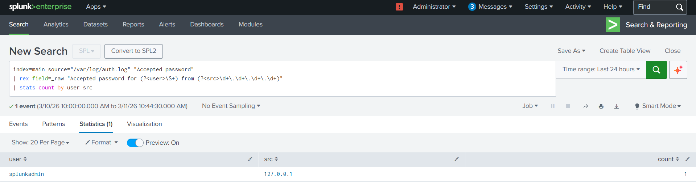
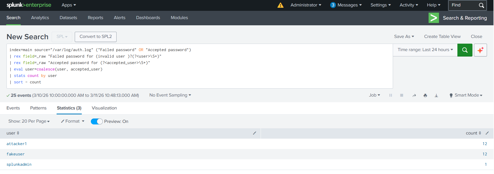
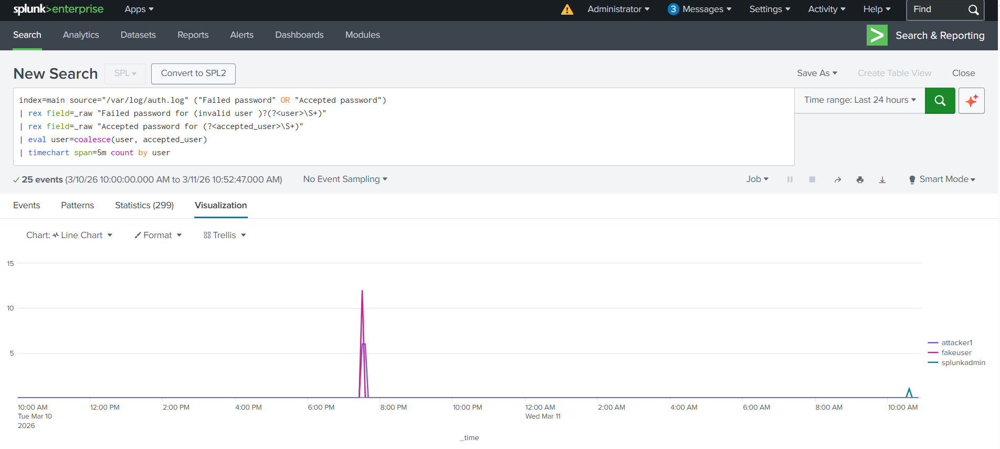
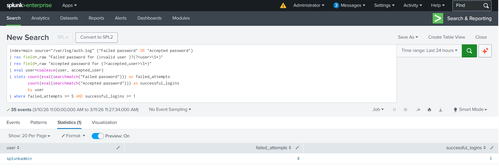

# Project 3 — Suspicious Login Investigation & Account Compromise Detection

## Overview

This project demonstrates how a Security Operations Center (SOC) analyst investigates suspicious authentication activity using Splunk. The objective was to detect and analyze successful SSH login events that occurred after repeated failed login attempts, which may indicate a potential account compromise.

Using Linux authentication logs from /var/log/auth.log, authentication events were ingested into Splunk and analyzed using SPL queries. The investigation involved identifying successful login events, extracting relevant fields such as usernames and source IP addresses, correlating failed and successful authentication attempts, and visualizing authentication activity over time.

The project concludes by creating a detection rule that identifies accounts experiencing multiple failed login attempts followed by successful authentication, a common indicator of brute force compromise.

This investigation demonstrates several key SOC analyst capabilities including log analysis, threat detection, authentication investigation, and SIEM detection engineering.

---

## Lab Environment
* **SIEM Platform:** Splunk Enterprise
* **Operating System:** Ubuntu Linux (VirtualBox VM)
* **Log Source:** `/var/log/auth.log`
* **Index:** `main`
* **Log Type:** SSH authentication logs

Authentication activity was simulated by generating both failed and successful SSH login attempts.

---

## Phase 1 — Successful SSH Login Detection

The investigation began by identifying successful SSH login events recorded in Linux authentication logs.

Linux records successful SSH authentication using messages such as:

Accepted password for username from IP_ADDRESS

These events confirm when a user successfully authenticates to the system.

### SPL Query
```spl
index=main source="/var/log/auth.log" "Accepted password"
```

### Purpose

Detect successful SSH authentication events within the SIEM.

### Successful SSH Login Detection


---

## Phase 2 — Extract User and Source IP

Authentication logs contain important information within the raw event message. Field extraction was used to identify the username and source IP address responsible for the login.

### SPL Query
```spl
index=main source="/var/log/auth.log" "Accepted password"
| rex field=_raw "Accepted password for (?<user>\S+) from (?<src>\d+\.\d+\.\d+\.\d+)"
| stats count by user src
```
### Purpose

Identify which user successfully authenticated and determine the origin of the login attempt.

### Successful Login Attribution


---

## Phase 3 — Authentication Activity Summary

The next step was to examine both failed and successful authentication events across all accounts.

This allowed the analyst to determine which users were targeted during authentication attacks and which accounts successfully logged in.

### SPL Query
```spl
index=main source="/var/log/auth.log" ("Failed password" OR "Accepted password")
| rex field=_raw "Failed password for (invalid user )?(?<user>\S+)"
| rex field=_raw "Accepted password for (?<accepted_user>\S+)"
| eval user=coalesce(user, accepted_user)
| stats count by user
| sort - count
```
### Purpose

Summarize authentication activity per user account.

Screenshot — Authentication Activity Summary


---

## Phase 4 — Authentication Activity Timeline

Time-based analysis is an important SOC investigation technique used to identify patterns in authentication activity.

Using Splunk’s timechart command, authentication events were grouped into five-minute intervals to visualize bursts of failed login attempts and correlate them with successful logins.

### SPL Query
```spl
index=main source="/var/log/auth.log" ("Failed password" OR "Accepted password")
| rex field=_raw "Failed password for (invalid user )?(?<user>\S+)"
| rex field=_raw "Accepted password for (?<accepted_user>\S+)"
| eval user=coalesce(user, accepted_user)
| timechart span=5m count by user
```
### Purpose

Visualize authentication activity to identify bursts of failed login attempts followed by successful access.

Screenshot — Authentication Activity Timeline


---

## Phase 5 — Detection Rule for Suspicious Login Activity

The final phase involved creating a detection rule to identify accounts that experienced repeated failed login attempts followed by successful authentication.

This pattern can indicate that an attacker eventually guessed the correct password or gained access to a compromised account.

### SPL Detection Query
```spl
index=main source="/var/log/auth.log" ("Failed password" OR "Accepted password")
| rex field=_raw "Failed password for (invalid user )?(?<user>\S+)"
| rex field=_raw "Accepted password for (?<accepted_user>\S+)"
| eval user=coalesce(user, accepted_user)
| stats count(eval(searchmatch("Failed password"))) as failed_attempts 
        count(eval(searchmatch("Accepted password"))) as successful_logins 
        by user
| where failed_attempts >= 5 AND successful_logins >= 1
```
### Purpose

Identify accounts where multiple failed authentication attempts were followed by successful login activity.

### Suspicious Login Detection


---

## Investigation Findings

The investigation revealed that the `splunkadmin` account experienced multiple failed login attempts followed by successful authentication.

Results showed:

* **8 failed login attempts**
* **3 successful logins**

This pattern represents suspicious authentication behavior because repeated failed login attempts preceding successful access may indicate brute force activity or password guessing.

Although the activity was generated intentionally within the lab environment, the detection logic mirrors real-world SOC investigation workflows used to identify potential account compromise.

---

## Key Skills Demonstrated

This project demonstrates several important SOC analyst capabilities:

* Splunk SPL query development
* authentication log analysis
* Linux SSH security monitoring
* field extraction using regex
* correlation of failed and successful authentication events
* time-based security event analysis
* threat detection engineering
* suspicious login investigation

---

## SOC Investigation Workflow

This project demonstrates a typical SOC authentication investigation workflow:
```
SSH Authentication Logs
        ↓
SIEM Log Ingestion
        ↓
Failed Login Analysis
        ↓
Successful Login Detection
        ↓
Authentication Timeline Correlation
        ↓
Suspicious Login Detection Rule
```

---

## Future Enhancements

In a production SOC environment, this detection could be enhanced with:

IP reputation intelligence
geographic login analysis
correlation with endpoint activity
multi-factor authentication monitoring
automated incident response workflows

These improvements help security teams detect and respond to account compromise more quickly.

---

## Author

Gelin Mawa
Cybersecurity Portfolio

GitHub Portfolio
https://github.com/Grammaton26
